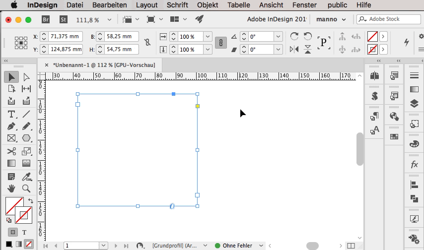

# Auto-Resize 1-Cell Table

This script is sort of a study, a proof of concept of hooking into some event that could seriously impede performance. Use at your own risk.

## The problem

InDesign does not have the feature to have a stroke on just one edge of text-frame. And there is no proper workaround for this (you can experiment with filling the frame with white and giving it a drop-shadow or apply a finely calculated gradient to the stroke or something, but – as I said – nothing proper).

The reason for this feature lack is probably that internally InDesign makes practically no differentiation between a rectangular and a freeform frame.

The one thing in InDesign that *does* have optional strokes on four sides is a cell in a table. (A cell is always rectangular so it always has four sides.)

Thinks: If Bluebottle found a way that the single cell in the single table in a text-frame could be automatically resized as soon as the text-frame changes size, this could work.

## The solution



Enter the event 'afterSelectionAttributeChanged'. This event is fired every time some selected object changes some attribute.

The script then makes a very quick check: Is the selected object a text-frame with one paragraph and one table which contains one cell?

If not: ignore.<br>
If yes: calculate the size of the frame and resize the cell.

The current script does not calculate the size of the cell accurately but cheats a bit.

After you put the script into your StartupScripts folder (see below) it runs quietly in the background.


## Installation

### Basic Installation

1. Open the Scripting Panel


2. Right-click the entry "User" and select "Reveal in Finder".


3. Place script in folder "Scripts Panel"


### Startup Scripts

Some scripts are declared as "Startup Scripts". These are scripts that are automatically run, right after InDesign starts.

For those simply create a folder with the name "Startup Scripts" right beside the "Scripts Panel" folder and place the script inside.

### Storing scripts somewhere else

The "Scripts Panel" folder is located in preferences folder of your current InDesign-Version.

I have installed several versions of InDesign (since the customer and his version is "always right" ;) ) but I want to have a single installation folder that is shared among the InDesign-versions.

It used to be that an alias was good enough for this purpose but that changed a few years ago. Now you need something that is called a [symbolic link](https://apple.stackexchange.com/questions/115646/how-can-i-create-a-symbolic-link-in-terminal).

1. Find the Terminal in Application:Utilities:
1. Open the folder that contains the folder where you want to store your scripts
1. Drag the folder-symbol in the window bar onto the Terminal


By dragging the folder onto the terminal that folder is automatically set as 'current folder' so you don’t have to bother about paths.

4. Now type `ln -s nameofsourcefolder nameofsymboliclink`

In my example:

``` bash
ln -s my\ real\ scripts\ folder/ my-scripts
```


5. Drag the link (here: `my-scripts`) into your "Scripts Panel" folder

### Folder Structure

Instead of simply putting all your scripts flat into the Scripts Panel you can create a folder structure.


The Scripts panel will show the same structure:


